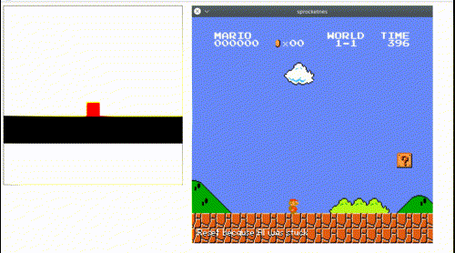

# Super Mario Bros neural network

Based on [MarI/O](https://www.youtube.com/watch?v=qv6UVOQ0F44) by [SethBling](https://www.youtube.com/channel/UC8aG3LDTDwNR1UQhSn9uVrw).

# Building

    cargo build --release

# Running

    make run

# NES emulator code

NES emulator related code is from
[sprocketnes](https://github.com/pcwalton/sprocketnes) by Patrick Walton.

# Resources

* [NEAT](http://nn.cs.utexas.edu/downloads/papers/stanley.ec02.pdf)
* [MarI/O](https://www.youtube.com/watch?v=qv6UVOQ0F44)
* https://en.wikipedia.org/wiki/Neuroevolution
* https://en.wikipedia.org/wiki/Evolutionary_algorithm
* https://en.wikipedia.org/wiki/Artificial_neural_network
* [Genetic algorithms](https://www.youtube.com/watch?v=9c1qo1eU1kY)
